<div align="center">

<picture>
  <source media="(prefers-color-scheme: dark)" srcset="ayan_banner_dark.svg">
  <source media="(prefers-color-scheme: light)" srcset="ayan_banner_light.svg">
  
</picture>

<br><br>

<a href="https://git.io/typing-svg">
  
</a>

<br><br>


<br><br>


</div>

<br>

## 👨‍💻 About Me

```dart
const ayan = {
  "name": "Ayan Javed",
  "role": "Flutter Developer",
  "focus": [
    "Flutter",
    "Dart",
    "Mobile App Development",
    "Firebase",
    "Riverpod"
  ],
  "architecture": [
    "Clean Architecture",
    "Feature-First Architecture",
    "Repository Pattern"
  ],
  "currentlyLearning": [
    "Advanced Flutter",
    "Riverpod",
    "Firebase",
    "REST APIs",
    "Backend Development"
  ],
  "goal": "Become a Professional Full Stack Software Engineer",
  "status": "Building, learning & shipping real-world projects"
};
```

I'm an aspiring **Flutter Developer** passionate about building clean, scalable, and user-friendly mobile applications.

I enjoy turning ideas into real applications while continuously improving my knowledge of **Dart, Flutter, Firebase, state management, software architecture, databases, and backend development**.

My long-term goal is to become a **professional Full Stack Software Engineer** capable of building complete, scalable, and production-ready applications.

<br>

## 🚀 Featured Projects

### 🎓 Tutor Tech

A comprehensive learning management platform designed to connect **tutors and students** through a structured digital learning environment.

**Key Features**

* 👨‍🏫 Tutor & Student roles
* 🔐 Firebase Authentication
* 👥 Student assignment & management
* 📚 Student groups
* 📅 Session management
* 📊 Tutor dashboard
* 🔥 Real-time Firestore data
* ⚡ Riverpod state management
* 🏗️ Feature-First Clean Architecture
* 📦 Repository Pattern
* 🔄 Real-time data synchronization

**Tech Stack**

<p>

</p>

---

### 🏥 Healthcare Management System

A healthcare management application focused on organizing healthcare-related information and providing a structured digital management experience.

**Key Features**

* 👤 User information management
* 🏥 Healthcare data management
* 📋 Organized records
* 🔐 Authentication
* 📱 Mobile-friendly interface
* 💾 Data persistence
* 🎨 Clean and intuitive UI

**Tech Stack**

<p>

</p>

---

### 🍰 Bake Time App

A Flutter mobile application focused on baking and recipe-related content with a clean and user-friendly mobile experience.

**Key Features**

* 🧁 Baking & recipe content
* 🔍 Easy navigation
* 📱 Mobile-first UI
* 🎨 Modern Flutter interface
* 🧩 Reusable widgets
* ⚡ Smooth user experience

**Tech Stack**

<p>

</p>

---

### 🎓 Student Info App

A Flutter application focused on managing and displaying student information through a simple and user-friendly interface.

**Key Features**

* 👨‍🎓 Student information management
* 📝 Add & update student data
* 🔍 Student information display
* 📱 Clean mobile UI
* 💾 Data management
* 🧩 Reusable Flutter widgets

**Tech Stack**

<p>

</p>

<br>

## 📱 Other Projects

### 📝 Notes App

A Flutter notes application created to practice local data persistence, CRUD operations, and application architecture.

**Tech:** Flutter • Dart • SQLite

🔗 [View Repository](https://github.com/Ayan99coder/notes_app)

---

### ✅ Task Management App

A task management application built while practicing Flutter UI, application logic, CRUD operations, and state management.

**Tech:** Flutter • Dart

🔗 [View Repository](https://github.com/Ayan99coder/task_management_app)

---

### 💬 Chat App

A Flutter-based chat application project focused on building interactive mobile interfaces and communication features.

**Tech:** Flutter • Dart

🔗 [View Repository](https://github.com/Ayan99coder/chat_app)

---

### 🧮 BMI Calculator

A Flutter application for calculating BMI while practicing UI development, input handling, and application logic.

**Tech:** Flutter • Dart

🔗 [View Repository](https://github.com/Ayan99coder/bmi_calculator)

---

### 🧠 AI Generated Quiz App

A quiz application project created to explore Flutter application development and AI-generated quiz content.

**Tech:** Flutter • Dart

🔗 [View Repository](https://github.com/Ayan99coder/quiz_app_AI_Generated)

---

### 🎯 Quiz Number Equation

A Flutter practice project focused on interactive quiz functionality and logic building.

**Tech:** Flutter • Dart

🔗 [View Repository](https://github.com/Ayan99coder/quiz_number_equation)

<br>

## 🛠️ Tech Stack

### 📱 Mobile Development

<p>

</p>

### 🔥 Backend & Database

<p>

</p>

### 💻 Programming Languages

<p>

</p>

### ⚡ State Management

```text
Riverpod
Notifier
AsyncNotifier
StreamProvider
Family Providers
AutoDispose
```

### 🏗️ Architecture

```text
Clean Architecture
Feature-First Architecture
Repository Pattern
Dependency Injection
Separation of Concerns
```

### 🧰 Development Tools

<p>

</p>

<br>

## 🧠 What I'm Learning

```text
Flutter
   ↓
Dart
   ↓
State Management
   ↓
Riverpod
   ↓
Firebase
   ↓
Clean Architecture
   ↓
Repository Pattern
   ↓
REST APIs
   ↓
Backend Development
   ↓
Full Stack Software Engineering
```

<br>

## 🎯 Current Focus

* 📱 Building production-style Flutter applications
* ⚡ Mastering Riverpod state management
* 🔥 Working with Firebase Authentication & Firestore
* 🏗️ Applying Clean Architecture
* 📦 Implementing Repository Pattern
* 🌐 Learning REST APIs
* 🗄️ Improving database knowledge
* 🧠 Strengthening Dart & OOP concepts
* 🚀 Building real-world portfolio projects
* 💻 Moving toward full-stack software engineering

<br>

## 📚 My Development Philosophy

> **Learn → Build → Break → Debug → Improve → Ship**

I believe the best way to learn software development is by building real projects and solving real problems.

Every project I build helps me understand something new — from Flutter widgets and state management to architecture, databases, authentication, and backend development.

<br>

## 📊 GitHub Stats

<div align="center">


<br><br>


</div>

<br>


## 📈 Contribution Graph

<div align="center">


</div>

<br>

## 🎯 2026 Goals

* [ ] Master Flutter
* [ ] Become highly proficient in Riverpod
* [ ] Build production-ready Flutter applications
* [ ] Master Clean Architecture
* [ ] Work extensively with Firebase
* [ ] Learn backend development
* [ ] Build full-stack applications
* [ ] Publish applications on Google Play Store
* [ ] Contribute to real-world projects
* [ ] Build and deploy production applications
* [ ] Grow into a professional software engineer

<br>

## 🤝 Connect With Me

<div align="center">

<a href="https://github.com/Ayan99coder">
  
</a>

<a href="https://www.linkedin.com/">
  
</a>

</div>

<br>

<div align="center">

### 💙 Building. Learning. Improving. Shipping.

**Every project is another step toward becoming a better software engineer.**

</div>
```
